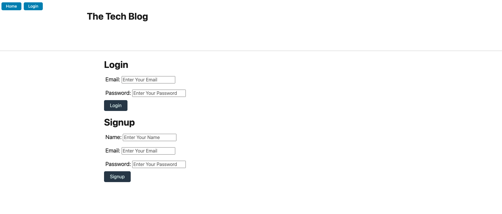
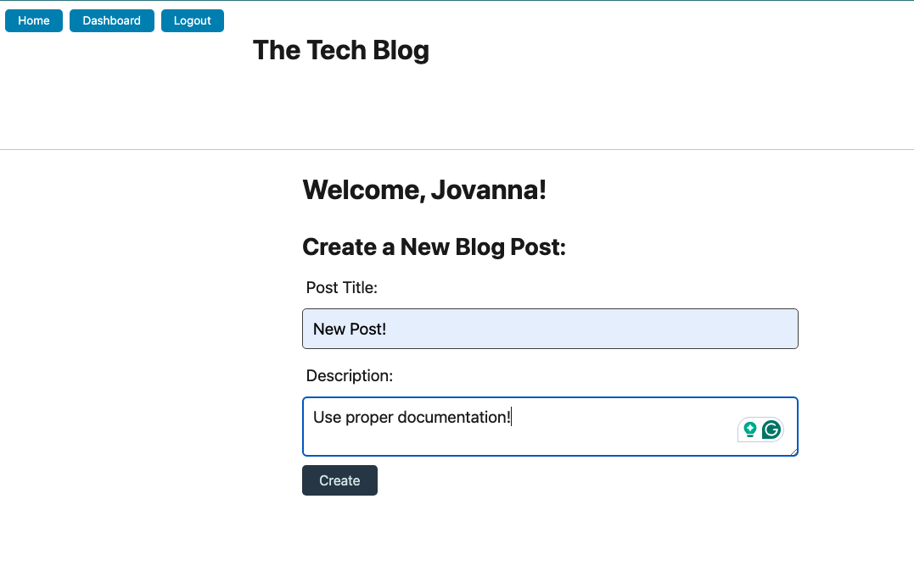
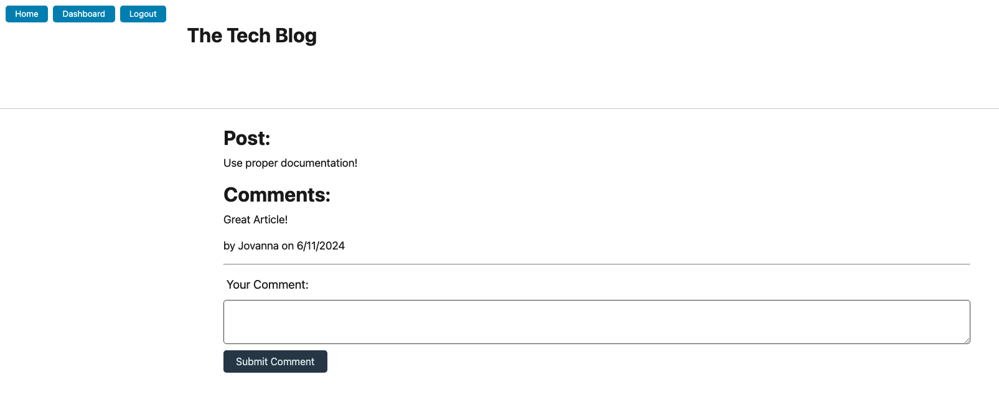

# The Tech Blog, A MVC Application

## Table of Contents 
- [Description](#description) 
- [Installation](#installation)
- [Usage](#usage)
- [Contribution](#contribution)
- [Examples](#examples)
- [License](#license)
- [Questions](#questions)

## Description 
    A CMS-style blog site where developers can publish their blog posts and comment on other developers' posts. 

## Installation 
    To successfully publish the application, the dotenv, express-handlebars and sequelize packages must be installed by running npm i sequelize, npm i express-handlebars and npm i dotenv respectively. Additionally, the node-postgres module must be installed by running the following line in your console: npm i pg. Finally, the application must be published using render.com. 

## Usage 
    To use the application, open the integrated terminal and begin by running the following line in the console to create a package.json file: npm init -y. Next, the dotenv and postgres modules must be installed as described above. To initialize the database, begin by running the schema file after logging into postgres. Then the database information must be seeded by running [node seed.js] Initiate the application by running the following line: node server. 
    
    To use the published application, visit https://tech-blog-mvc-4.onrender.com/login 

## Contribution 
- Handlebars documentation: https://handlebarsjs.com/
- Sequelize documentation: https://sequelize.org/docs/v6/ 
- Dotenv documentation: https://www.npmjs.com/package/dotenv
- Node-postgress documentation: https://www.npmjs.com/package/pg
- Mini-Project: Travel Planner
- BootCampSpot Tutoring Services

## Examples  
- 
- 
- 

## License 
    N/A

## Questions 
    For any questions, please contact [jovanna24](https://github.com/jovanna24) at jovannajimenez1124@gmail.com.